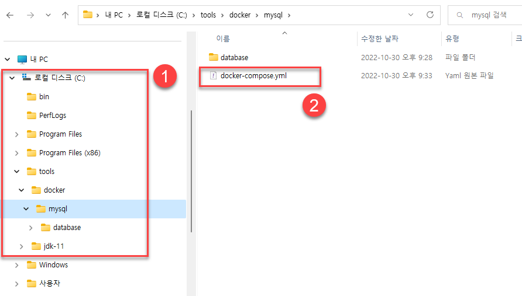
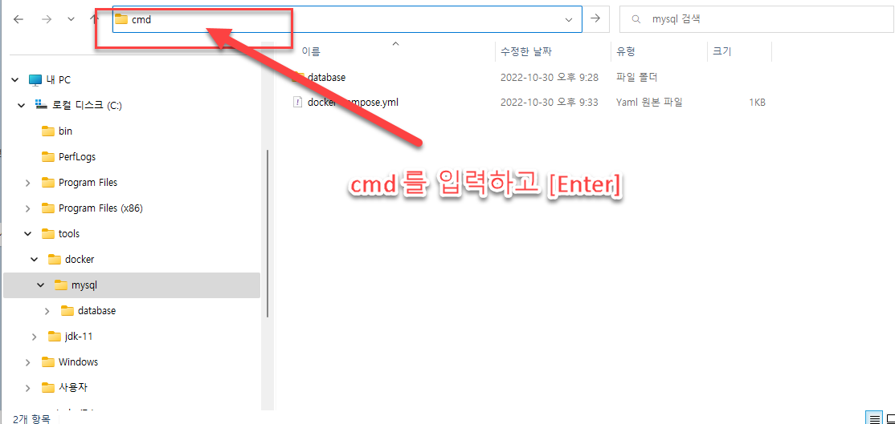
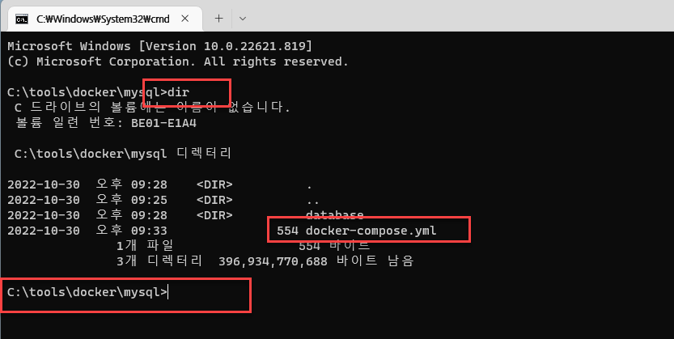
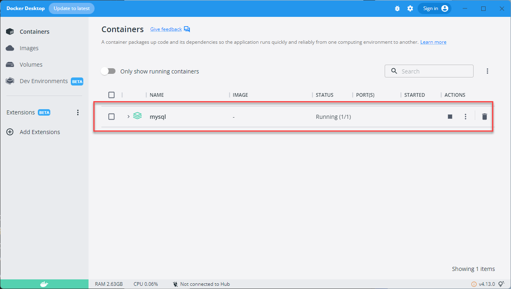

- Docker Desktop 을 설치했다면 mysql 폴더를 탐색기를 만들고 그 안에 docker-compose.yml 파일을 작성한다.
- https://gist.github.com/urstoryp/cf46d93158e3d4ded1038be39fc227b4 를 참고로 한다.

---

- mysql 폴더안에 docker-compose.yml파일이 있다.

---

- 파일 탐색기에서 cmd를 입력하고 엔터를 입력한다.

---

- cmd 창이 열리는데 dir 이라고 명령을 하고 Enter를 입력한다. 화면에서처럼 docker-compose.yml파일이 있어야 한다.

---

docker-compose up -d

위와 같이 명령하면 docker가 실행된다.

---

- Docker Desktop을 실행하면 이렇게 실행이 되고 있어야 한다.

---

## 다음과 같이 오류가 발생할 경우 해결방법

Error response from daemon: invalid mount config for type "bind": bind source path does not exist: /Users/urstory/devel/docker/mysql_study/database/init

와 같은 오류가 발생할 경우

❯ mkdir database
❯ mkdir database/init
❯ mkdir database/datadir

docker-compose.yml이 있는 폴더에서 위와 같이 폴더를 생성후 실행한다.

---
